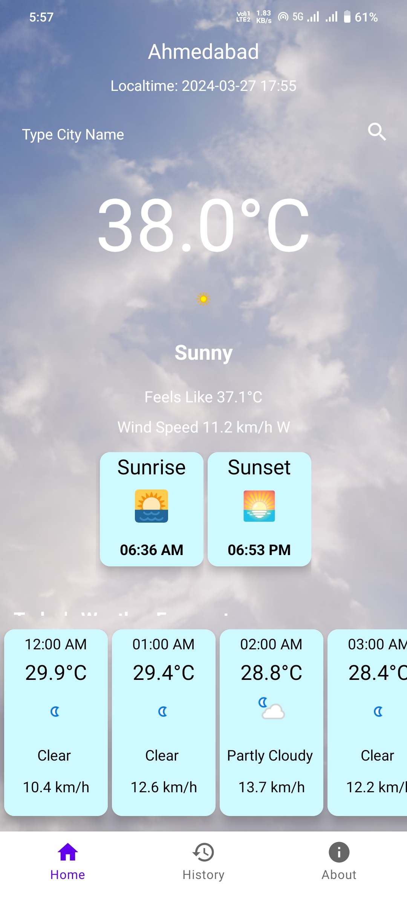

### About

**_WeatherApp_** is an Android application developed using the Java programming language. Its primary purpose is to provide users with the weather forecast of the day based on their location. Upon launch and granting location permission, the application displays the forecast of the device’s last known location. Additionally, users can search for weather forecasts of any city. The weather data is accessed from the API provided by [__weatherapi.com__](https://www.weatherapi.com). The application provides information such as current temperature, weather status with the feel, wind speed, as well as details about sunrise and sunset. It also features a 24-hour forecast. Furthermore, the app includes a history section where users' searched cities are saved in a list.

### Project by

- Gojiya Jayesh, Email: jayeshgojiya1168@gmail.com

### Project Assigned by

- Bharat Intern

### Build Tools

- Android Studio Koala | 2023.3.2 Canary 2
- Gradle Version 7.2

### Screenshots




### Installation

To install the WeatherApp on your Android device, follow these steps:

1. Clone the repository to your local machine:

   ```bash
   git clone https://github.com/gojiyajayesh/WeatherApp.git
   ```

2. Open the project in Android Studio.

3. Connect your Android device to your computer using a USB cable.

4. Build and run the project on your device.

### Download APK

You can download the latest version of the WeatherApp APK [here](https://github.com/gojiyajayesh/WeatherApp/blob/main/apkfile/WeatherApp.apk).